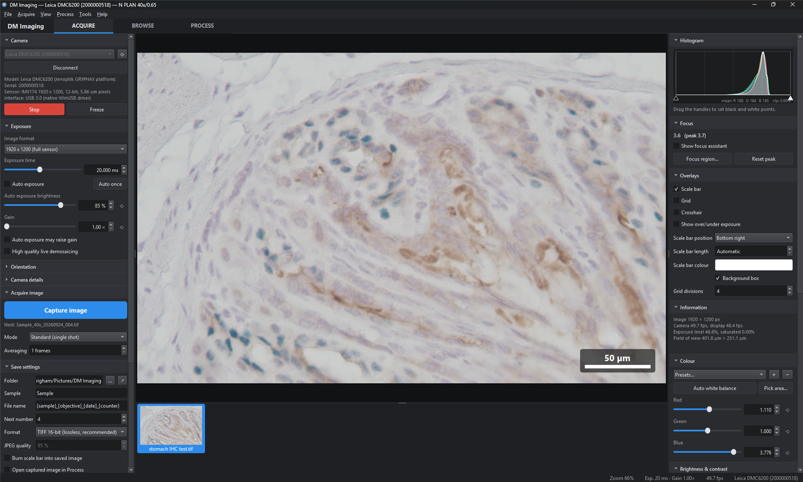

# DM Imaging

Image acquisition and analysis software for the **Leica DM2000** bright-field
microscope with the **Leica DMC6200** camera. It replaces Leica LAS X for
daily imaging and includes its own native camera driver.

Runs on **Windows, macOS and Linux** from one source tree, with the same
features and the same interface on all three (see [Platforms](#platforms)).

**Download:** the Windows installer is attached to each
[release](https://github.com/fgarbicz/leica_microscope/releases/latest). macOS and
Linux are built from source with one script ([Install](#install)).
What changed: [RELEASE_NOTES.md](RELEASE_NOTES.md).



## Features

**Camera and driver**
- Native USB 3.0 driver for the DMC6200 (Jenoptik GRYPHAX platform, Sony IMX174,
  1920 × 1200, 12-bit). No Leica software is needed, on any platform: WinUSB on
  Windows, libusb on macOS and Linux. See [docs/DMC6200_PROTOCOL.md](docs/DMC6200_PROTOCOL.md).
- Live image at about 58 fps at full resolution, with a smooth zoom/pan view, minimap and pixel readout.
- Exposure from 26 µs to 60 s, analog gain up to 16×, and auto exposure (continuous or once).
- Centre ROI mode for faster frame rates.
- Pixel-shift capture:
  - 4-shot true colour, where every pixel records measured R, G and B
  - 16-shot 3840 × 2400
  - 36-shot 5760 × 3600
- HDR capture: 2 or 3 exposures (1×, 4×, 16×) merged in the raw sensor data into
  one 16-bit image, so dark DAB and haematoxylin are recorded with far less noise
  while the background stays unclipped.
- Automatic reconnection if the USB connection drops.
- Video recording of the live image (Motion-JPEG AVI, optional scale bar).
- Also supports any UVC camera (Media Foundation on Windows, AVFoundation on macOS,
  Video4Linux on Linux) and includes a simulator.

**Image quality**
- 16-bit linear processing. Captures use high-quality (Malvar–He–Cutler) demosaicing.
- White balance: automatic (bright-field background) or picked from a region.
- Black balance, levels, gamma, brightness, contrast, saturation, hue, sharpening, monochrome.
- Colour presets (IHC/DAB, H&E, publication), plus your own.
- Shading (flat-field) correction, stored per objective.
- Frame averaging for low-noise captures.
- Over/under-exposure display, live histogram with draggable level handles, focus assistant.

**Microscope**
- Objectives 2.5×, 5×, 10×, 20×, 40× and 100×.
- Calibration is nominal (from the camera adapter) or measured with a stage micrometer.
- *Tools → Correct pixel size of saved images* repairs the scale recorded in images saved
  with the old 0.7× adapter assumption, and leaves calibrated images alone.
- After every capture, a dialog asks for the **magnification and image name**.
- Exposure, gain and white balance are remembered per objective.
- Calibrated scale bar, grid and crosshair overlays.

**Serial sections (the same area, stained for another marker)**
- Double-click a captured image to open it in the system viewer (Photos, Preview or
  the desktop's viewer), e.g. on a second screen, while the live image keeps running.
- Reference overlay (Ctrl+R / Cmd+R): an earlier capture shown semi-transparently over
  the live image, to find the same area on the next slide.
- *Compare two images* aligns the two sections automatically, so synchronised zoom
  and pan show the same cells in both.

**Advanced acquisition**
- Multifocus (extended depth of field) from a manual focus sweep, with drift compensation.
- Live Image Builder: stitching while you move the stage by hand.
- Time lapse.

**Browse and process**
- File browser with thumbnails, preview and full metadata.
- Measurements: length, path, rectangle, ellipse, polygon area, angle, cell counting, arrows and text.
  - Undo/redo; annotations are stored next to the image.
  - CSV export of measurements.
- IHC quantification: colour deconvolution (haematoxylin/DAB), DAB-positive area %, intensity classes and H-score, for the whole image or a region, with overlay.
- Side-by-side comparison with synchronised, aligned zoom and pan; batch export for presentations.
- Non-destructive adjustments.
- Export with burned-in scale bar and annotations; copy to clipboard; print.
- Multifocus and stitching from existing image files.

**Interface**
- Dark and light themes.
- Interface size adjustable from 75% to 200% (text, controls, icons and spacing
  together), applied immediately and remembered.
- Side panels grouped by function, with the mouse wheel reserved for scrolling so it
  cannot change a setting by accident.
- Captured images shown as a reel under the live image or as a vertical list beside it,
  whichever suits the screen, in the order they were taken.
- Projects: in the list, images are grouped under the folder they were saved in; the
  project name renames the folder, and *File → Open project folder* lists an existing
  one to continue it. Captured images can be renamed (F2), file and metadata together.
- Pane sizes are remembered between sessions.

**Files**
- TIFF output: 16-bit or 8-bit, lossless Deflate, with the calibration in the
  resolution tags (ImageJ/Fiji/QuPath read the µm scale) and all acquisition
  metadata as JSON in ImageDescription.
- PNG (8/16-bit), JPEG and BMP, with a JSON sidecar.
- Leica **.lif** (LAS X experiment files): read any image out of one, with the name
  and calibration LAS X stored (a multi-channel fluorescence image opens as its first
channel), and write the images of a session into one .lif.
  See [docs/LIF_FORMAT.md](docs/LIF_FORMAT.md).

## Platforms

| | Windows 10/11 | macOS | Linux |
|---|---|---|---|
| Leica DMC6200 (native driver) | yes, via WinUSB | yes, via libusb | yes, via libusb |
| Camera setup needed | install the WinUSB driver once | none | install a udev rule once |
| Other UVC cameras | Media Foundation | AVFoundation | Video4Linux2 |
| — manual exposure / gain on those | yes | no¹ | if the camera supports it |
| USB-C port power cycle for a stuck camera | yes² | unplug the cable | unplug the cable |
| Everything else³ | identical | identical | identical |

¹ macOS has no manual exposure API for UVC cameras (AVFoundation's manual mode is
iOS only). The exposure and gain controls are disabled for such a camera and say
so. This does not affect the DMC6200, which is driven directly over USB and has
full manual control on every platform.

² Through the UCSI connector manager, which exists only on Windows.

Windows means 64-bit x64; Windows 11 on ARM runs the x64 build under emulation, or
a native ARM64 build (`-Arch arm64`). On macOS the app runs on the macOS version its
bundled Homebrew libraries were built for, or newer (see
[docs/DEPLOYMENT.md](docs/DEPLOYMENT.md#macos)). Linux needs Qt 6.4 or newer
(Debian 12, Ubuntu 24.04 or later).

³ Imaging, colour, IHC quantification, measurements, multifocus, stitching, time
lapse, video, file formats and the whole user interface are shared code and behave
the same everywhere. The interface uses one style and one icon set on all three
platforms; only the base font size is adjusted per platform so that the three
builds look alike.

## Install

### Windows

Download **`DMImaging-Setup-<version>.exe`** from the
[latest release](https://github.com/fgarbicz/leica_microscope/releases/latest) (or make it
yourself, see [below](#making-the-windows-installer)), run it on the microscope PC and follow the
wizard. Windows asks for administrator permission once. Setup:

- installs DM Imaging for all users to `C:\Program Files\DM Imaging`, with Start-menu
  entries (app and user guide) and an optional desktop shortcut;
- installs the Microsoft Visual C++ runtime if it is missing;
- optionally installs the **camera driver** (ticked by default). This binds Microsoft's
  WinUSB driver to the Leica DMC6200; no kernel code is installed. If the camera already
  uses the driver, nothing is changed. Connect the camera before or after installing.

Upgrading: run a newer Setup; settings and images are kept. Uninstall from *Windows
Settings → Apps*; this also removes the driver package (settings and images are kept).

Requirements: Windows 10/11 64-bit, a USB 3.0 port for the camera.

The driver can also be installed or repaired later with *Tools → Install / repair camera
driver* in the app.

### macOS

```bash
brew install qt libusb          # build requirements
./install.sh                    # build, bundle the Qt runtime, install to /Applications
```

No driver is needed: macOS lets the application talk to the camera directly. The first
time a UVC camera is used, macOS asks for camera permission; the DMC6200 does not need
it. Apple silicon or Intel.

`./install.sh --uninstall` removes the app. Settings (`~/Library/Preferences`) and your
images are kept.

### Linux

```bash
sudo apt install qt6-base-dev qt6-svg-dev libusb-1.0-0-dev cmake ninja-build build-essential
./install.sh                            # build and install into /usr/local
sudo bash driver/install_udev_rule.sh     # camera access without root
```

The udev rule (`driver/99-leica-dmc6200.rules`) gives the logged-in desktop user access to
the camera; unplug and replug it afterwards. Without it the camera is visible but cannot be
opened. The same rule can be installed from *Tools → Install camera access rule* in the app.

`./install.sh --uninstall` removes it again.

### Making the Windows installer

```powershell
.\tools\make_installer.ps1     # build, run all tests, package -> dist\DMImaging-Setup-<version>.exe
```

Needs the build requirements below plus Inno Setup 6 (`ISCC.exe`), and Python with the
`markdown` package for the HTML user guide (optional). It builds, runs all four tests and
refuses to package if any fails. `-Arch arm64` makes a Windows-on-ARM installer
(`DMImaging-Setup-<version>-arm64.exe`) from an ARM64 Qt.

## Build from source

### Windows

Prerequisites (all free):

- Visual Studio 2022 Build Tools with the *Desktop development with C++* workload
  (MSVC and a Windows SDK). On a Windows-on-ARM PC add the *MSVC ARM64* and *x64* compilers.
- Qt 6.8 for MSVC 2022, by default in `%USERPROFILE%\devtools\Qt\6.8.3\msvc2022_64`
  (`msvc2022_arm64` for ARM64), or anywhere with `-QtDir`. The Qt online installer works,
  or [aqtinstall](https://github.com/miurahr/aqtinstall):
  `python -m aqt install-qt windows desktop 6.8.3 win64_msvc2022_64 -O %USERPROFILE%\devtools\Qt`
- CMake 3.24+ and Ninja (Visual Studio's own copies are used if they are not on `PATH`).
- PowerShell must be allowed to run local scripts, once per user:
  `Set-ExecutionPolicy -Scope CurrentUser RemoteSigned`

```powershell
.\build.ps1 -Test          # Release build + all four tests
.\build.ps1 -Deploy        # also copies the Qt runtime next to the exe
.\build.ps1 -Arch arm64    # Windows on ARM (x64 is the default, and builds on ARM too)
.\build.ps1 -Clean -Test   # from scratch
```

The script finds Visual Studio itself and picks the right compiler for the machine,
including cross-compiling x64 on an ARM64 PC.

### macOS and Linux

Qt 6.4+ (with Qt SVG), libusb-1.0, CMake 3.24+, Ninja and a C++20 compiler:

```bash
# macOS   brew install qt libusb cmake ninja
# Linux   sudo apt install qt6-base-dev qt6-svg-dev libusb-1.0-0-dev cmake ninja-build build-essential
./build.sh --test           # Release build + all four tests
./build.sh --deploy         # bundle the Qt runtime (.app on macOS, AppImage on Linux)
./build.sh --debug --clean
```

### Tests

`--test` / `-Test` runs all four through CTest, without a screen (so also over SSH or in
a container):

| Test | Covers |
|---|---|
| `lmtests` | imaging: demosaicing, colour, stacking, stitching, IHC, nucleus detection |
| `iotest` | file formats: TIFF, PNG, JPEG, `.lif`, metadata, the pixel-size repair |
| `enginetest` | acquisition engine against the simulated camera: live, capture, HDR, multifocus, stitching |
| `uitest` | interface behaviour: wheel guard, interface size, icons, gallery, compare alignment, settings |

With a camera connected, two more check the hardware (in `build/release/bin`):

```
lmtests --hw     # hardware test of the DMC6200
dmctest          # command-line test of the native camera driver
```

## Project layout

| Path | Contents |
|---|---|
| `src/camera/` | camera abstraction, DMC6200 driver (`leica/`), USB backends (`usb/`: WinUSB and libusb), UVC backends (Media Foundation / AVFoundation / V4L2), simulator |
| `src/imaging/` | demosaicing, colour pipeline, shading, analysis, registration, focus stacking, stitching, pixel shift |
| `src/io/` | TIFF encoder/decoder, image I/O, metadata, Leica `.lif`, pixel-size repair |
| `src/app/` | acquisition engine, settings, calibration, `main.cpp` |
| `src/ui/` | Qt user interface |
| `driver/` | WinUSB INF and installer (Windows), udev rule and installer (Linux) |
| `tests/` | unit, hardware and integration tests |
| `tools/` | build helpers and reverse-engineering tools used to document the camera protocol |
| `resources/` | icons, Windows version info, macOS `Info.plist`, Linux desktop entry |
| `docs/` | user guide, deployment checklist, camera protocol and `.lif` format |

## License

Copyright (c) 2026 Filip Garbicz.

DM Imaging is free software: you can redistribute it and/or modify it under the
terms of the GNU General Public License as published by the Free Software
Foundation, either version 3 of the License, or (at your option) any later version.
It is distributed in the hope that it will be useful, but WITHOUT ANY WARRANTY;
without even the implied warranty of MERCHANTABILITY or FITNESS FOR A PARTICULAR
PURPOSE. See [LICENSE](LICENSE) for the full text.

It uses Qt (LGPL v3) and, on macOS and Linux, libusb (LGPL 2.1); see
[THIRD_PARTY_NOTICES.md](THIRD_PARTY_NOTICES.md). The license files are installed
with the application on every platform.

## Documentation

| Document | For |
|---|---|
| [docs/USER_GUIDE.md](docs/USER_GUIDE.md) | day-to-day use (also *Help → User guide*, F1, in the app) |
| [docs/DEPLOYMENT.md](docs/DEPLOYMENT.md) | installing, verifying and rolling back on the microscope PC; macOS and Linux |
| [docs/DMC6200_PROTOCOL.md](docs/DMC6200_PROTOCOL.md) | the camera's USB protocol, as implemented by the native driver |
| [docs/LIF_FORMAT.md](docs/LIF_FORMAT.md) | the Leica .lif file format |
| [RELEASE_NOTES.md](RELEASE_NOTES.md) | what changed in each version |
